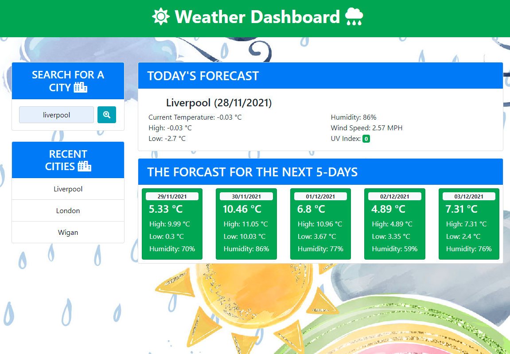

**WeatherDB**

[Weather Dashboard](https://daveydavey1901.github.io/WeatherDB/)

**Description**

**in this weeks assignment you had to create a Weather Dashboard utilising HTML, CSS and JavaScript. you had to ensure the following:-**

GIVEN a weather dashboard with form inputs
 
1. WHEN I search for a city   
      THEN I am presented with current and future conditions for that city and that city is added to the search history
      
2. WHEN I view current weather conditions for that city  
      THEN I am presented with the city name, the date, an icon representation of weather conditions, the temperature, the humidity, the wind speed, and the UV index

3. WHEN I view the UV index  
      THEN I am presented with a color that indicates whether the conditions are favorable, moderate, or severe

4. WHEN I view future weather conditions for that city  
      THEN I am presented with a 5-day forecast that displays the date, an icon representation of weather conditions, the temperature, the wind speed, and the humidity

5. WHEN I click on a city in the search history  
      THEN I am again presented with current and future conditions for that city

**Approach / Design**

This was a tough one for many reasons and at the time of writing this still had a few things to resolve (listed below).  I continue to stuggle with local storage and getting the requied information from the API.  its taken a lot of reading and watching videos and reading and watching the lessons over again... the code for this one is a bit messy as i rushed it in the end to try and get as much working as possible.  

I wanted to design this piece of homework in a fun and colourful way as i wanted to use it on my Teachers ToolBox project as one of the utilities.  i got the background design from my Envato Elements account.

I needed to sign up to Open Weather to use their API.  This is a great API with a huge amount of data to utilise. 

**Errors At The Moment To Address**
1.  tidy up the margins and padding so it adjusts better as screen size is reduced.

**Visuals on Desktop**

| Weather Dashboard    |
|----------------------|
||

      
**Acknowledgment**

**People/sites used for help**

  [Stack Overflow](https://stackoverflow.com/) 
  [MDN](https://developer.mozilla.org/en-US/)
  
 **Sites i used for resources**
 
  [Open Weather](https://openweathermap.org/api/one-call-api). 
  [Envato Elements](https://elements.envato.com/). (paid subscription).
  
**Future Plans** 
 This is a project i do want to expand on and include more of the data that is available for the Open Weather Api Maps, Historic Weather, links to weather related webpages... and much more.. this will then be used in my Teachers TooBox Project.
